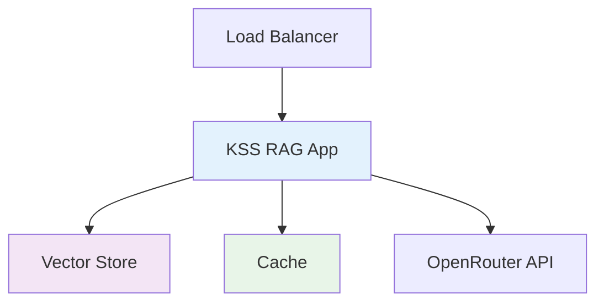
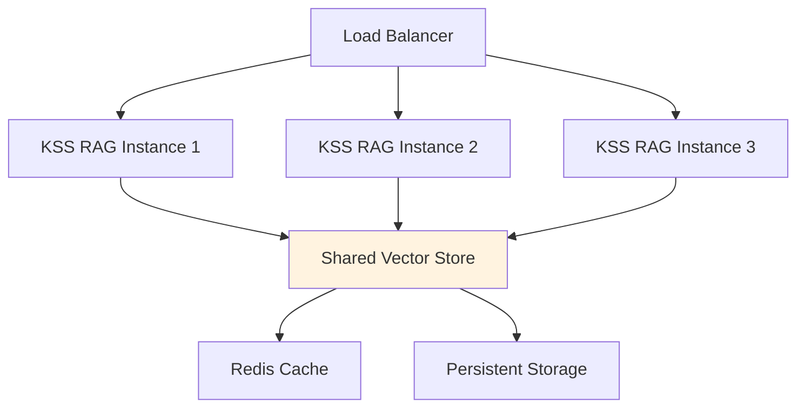

# Deployment Guide

## Overview

This guide covers production deployment strategies for KSS RAG, including Docker, Kubernetes, cloud platforms, and monitoring configurations.

## Deployment Architectures

### Single Instance Deployment



### Multi-Instance Deployment



## Docker Deployment

### Basic Dockerfile

```dockerfile
# Dockerfile
FROM python:3.11-slim

# Install system dependencies
RUN apt-get update && apt-get install -y \
    tesseract-ocr \
    tesseract-ocr-eng \
    libgl1 \
    libglib2.0-0 \
    && rm -rf /var/lib/apt/lists/*

# Set working directory
WORKDIR /app

# Copy requirements and install Python dependencies
COPY requirements.txt .
RUN pip install --no-cache-dir -r requirements.txt

# Copy application code
COPY . .

# Create non-privileged user
RUN useradd -m -u 1000 kssrag
USER kssrag

# Expose port
EXPOSE 8000

# Health check
HEALTHCHECK --interval=30s --timeout=10s --start-period=5s --retries=3 \
    CMD curl -f http://localhost:8000/health || exit 1

# Start command
CMD ["python", "-m", "kssrag.cli", "server", "--host", "0.0.0.0", "--port", "8000"]
```

### Optimized Dockerfile

```dockerfile
# Multi-stage build for production
FROM python:3.11-slim as builder

WORKDIR /app

# Install build dependencies
RUN apt-get update && apt-get install -y \
    gcc \
    g++ \
    && rm -rf /var/lib/apt/lists/*

# Copy requirements
COPY requirements.txt .

# Install dependencies
RUN pip install --user --no-cache-dir -r requirements.txt

# Runtime stage
FROM python:3.11-slim

# Install runtime dependencies
RUN apt-get update && apt-get install -y \
    tesseract-ocr \
    tesseract-ocr-eng \
    libgl1 \
    && rm -rf /var/lib/apt/lists/*

WORKDIR /app

# Copy Python dependencies from builder
COPY --from=builder /root/.local /root/.local

# Copy application
COPY . .

# Ensure packages are in PATH
ENV PATH=/root/.local/bin:$PATH

# Create app user
RUN useradd -m -u 1000 kssrag
USER kssrag

EXPOSE 8000

HEALTHCHECK --interval=30s --timeout=10s --start-period=30s --retries=3 \
    CMD curl -f http://localhost:8000/health || exit 1

CMD ["python", "-m", "kssrag.cli", "server", "--host", "0.0.0.0", "--port", "8000"]
```

### Docker Compose

```yaml
# docker-compose.yml
version: '3.8'

services:
  kssrag:
    build: .
    ports:
      - "8000:8000"
    environment:
      - OPENROUTER_API_KEY=${OPENROUTER_API_KEY}
      - VECTOR_STORE_TYPE=hybrid_offline
      - CHUNK_SIZE=1000
      - TOP_K=8
      - ENABLE_CACHE=true
    volumes:
      - ./documents:/app/documents
      - kssrag_cache:/app/.cache
    restart: unless-stopped
    healthcheck:
      test: ["CMD", "curl", "-f", "http://localhost:8000/health"]
      interval: 30s
      timeout: 10s
      retries: 3
      start_period: 40s

volumes:
  kssrag_cache:
```

### Production Docker Compose

```yaml
# docker-compose.prod.yml
version: '3.8'

services:
  kssrag:
    build: 
      context: .
      dockerfile: Dockerfile
    image: kssrag:latest
    ports:
      - "8000:8000"
    environment:
      - OPENROUTER_API_KEY=${OPENROUTER_API_KEY}
      - VECTOR_STORE_TYPE=hybrid_offline
      - CHUNK_SIZE=1000
      - TOP_K=8
      - BATCH_SIZE=32
      - ENABLE_CACHE=true
      - CACHE_DIR=/cache
      - LOG_LEVEL=INFO
      - SERVER_HOST=0.0.0.0
      - SERVER_PORT=8000
    volumes:
      - document_volume:/app/documents
      - cache_volume:/cache
    restart: unless-stopped
    deploy:
      resources:
        limits:
          memory: 2G
          cpus: '1.0'
        reservations:
          memory: 1G
          cpus: '0.5'
    healthcheck:
      test: ["CMD", "curl", "-f", "http://localhost:8000/health"]
      interval: 30s
      timeout: 10s
      retries: 3
      start_period: 60s

  nginx:
    image: nginx:alpine
    ports:
      - "80:80"
      - "443:443"
    volumes:
      - ./nginx.conf:/etc/nginx/nginx.conf
      - ./ssl:/etc/nginx/ssl
    depends_on:
      - kssrag
    restart: unless-stopped

volumes:
  document_volume:
  cache_volume:
```

## Kubernetes Deployment

### Basic Deployment

```yaml
# k8s/deployment.yaml
apiVersion: apps/v1
kind: Deployment
metadata:
  name: kssrag
  labels:
    app: kssrag
    version: v1
spec:
  replicas: 3
  selector:
    matchLabels:
      app: kssrag
  template:
    metadata:
      labels:
        app: kssrag
      annotations:
        prometheus.io/scrape: "true"
        prometheus.io/port: "8000"
        prometheus.io/path: "/metrics"
    spec:
      containers:
      - name: kssrag
        image: kssrag:latest
        ports:
        - containerPort: 8000
        env:
        - name: OPENROUTER_API_KEY
          valueFrom:
            secretKeyRef:
              name: kssrag-secrets
              key: openrouter-api-key
        - name: VECTOR_STORE_TYPE
          value: "hybrid_offline"
        - name: CHUNK_SIZE
          value: "1000"
        - name: TOP_K
          value: "8"
        - name: ENABLE_CACHE
          value: "true"
        - name: CACHE_DIR
          value: "/cache"
        resources:
          requests:
            memory: "1Gi"
            cpu: "500m"
          limits:
            memory: "2Gi"
            cpu: "1000m"
        livenessProbe:
          httpGet:
            path: /health
            port: 8000
          initialDelaySeconds: 30
          periodSeconds: 10
          timeoutSeconds: 5
        readinessProbe:
          httpGet:
            path: /health
            port: 8000
          initialDelaySeconds: 5
          periodSeconds: 5
          timeoutSeconds: 3
        volumeMounts:
        - name: cache-volume
          mountPath: /cache
        - name: documents-volume
          mountPath: /app/documents
      volumes:
      - name: cache-volume
        emptyDir: {}
      - name: documents-volume
        persistentVolumeClaim:
          claimName: kssrag-documents-pvc
---
apiVersion: v1
kind: Service
metadata:
  name: kssrag-service
spec:
  selector:
    app: kssrag
  ports:
  - name: http
    port: 80
    targetPort: 8000
  type: LoadBalancer
```

### Advanced Kubernetes Configuration

```yaml
# k8s/advanced-deployment.yaml
apiVersion: apps/v1
kind: Deployment
metadata:
  name: kssrag
spec:
  replicas: 3
  strategy:
    type: RollingUpdate
    rollingUpdate:
      maxSurge: 1
      maxUnavailable: 0
  selector:
    matchLabels:
      app: kssrag
  template:
    metadata:
      labels:
        app: kssrag
    spec:
      affinity:
        podAntiAffinity:
          preferredDuringSchedulingIgnoredDuringExecution:
          - weight: 100
            podAffinityTerm:
              labelSelector:
                matchExpressions:
                - key: app
                  operator: In
                  values:
                  - kssrag
              topologyKey: kubernetes.io/hostname
      containers:
      - name: kssrag
        image: kssrag:latest
        ports:
        - containerPort: 8000
        env:
        - name: OPENROUTER_API_KEY
          valueFrom:
            secretKeyRef:
              name: kssrag-secrets
              key: openrouter-api-key
        - name: VECTOR_STORE_TYPE
          value: "hybrid_offline"
        - name: NODE_NAME
          valueFrom:
            fieldRef:
              fieldPath: spec.nodeName
        - name: POD_NAME
          valueFrom:
            fieldRef:
              fieldPath: metadata.name
        - name: POD_NAMESPACE
          valueFrom:
            fieldRef:
              fieldPath: metadata.namespace
        resources:
          requests:
            memory: "1Gi"
            cpu: "500m"
          limits:
            memory: "2Gi"
            cpu: "1000m"
        livenessProbe:
          httpGet:
            path: /health
            port: 8000
            httpHeaders:
            - name: Custom-Health-Check
              value: "KSS-RAG-Probe"
          initialDelaySeconds: 45
          periodSeconds: 20
          timeoutSeconds: 10
          failureThreshold: 3
        readinessProbe:
          httpGet:
            path: /health
            port: 8000
          initialDelaySeconds: 5
          periodSeconds: 10
          timeoutSeconds: 5
          successThreshold: 1
          failureThreshold: 3
        lifecycle:
          preStop:
            exec:
              command: ["/bin/sh", "-c", "sleep 30"]
        volumeMounts:
        - name: cache
          mountPath: /cache
        - name: config
          mountPath: /app/config
      volumes:
      - name: cache
        persistentVolumeClaim:
          claimName: kssrag-cache-pvc
      - name: config
        configMap:
          name: kssrag-config
---
apiVersion: v1
kind: ConfigMap
metadata:
  name: kssrag-config
data:
  config.yaml: |
    vector_store_type: hybrid_offline
    chunk_size: 1000
    top_k: 8
    batch_size: 32
    enable_cache: true
    log_level: INFO
```

### Horizontal Pod Autoscaler

```yaml
# k8s/hpa.yaml
apiVersion: autoscaling/v2
kind: HorizontalPodAutoscaler
metadata:
  name: kssrag-hpa
spec:
  scaleTargetRef:
    apiVersion: apps/v1
    kind: Deployment
    name: kssrag
  minReplicas: 2
  maxReplicas: 10
  metrics:
  - type: Resource
    resource:
      name: cpu
      target:
        type: Utilization
        averageUtilization: 70
  - type: Resource
    resource:
      name: memory
      target:
        type: Utilization
        averageUtilization: 80
  behavior:
    scaleDown:
      stabilizationWindowSeconds: 300
      policies:
      - type: Percent
        value: 50
        periodSeconds: 60
    scaleUp:
      stabilizationWindowSeconds: 60
      policies:
      - type: Percent
        value: 100
        periodSeconds: 60
```

## Cloud Platform Deployment

### AWS ECS Deployment

```yaml
# aws/task-definition.json
{
  "family": "kssrag",
  "networkMode": "awsvpc",
  "requiresCompatibilities": ["FARGATE"],
  "cpu": "1024",
  "memory": "2048",
  "executionRoleArn": "arn:aws:iam::123456789012:role/ecsTaskExecutionRole",
  "taskRoleArn": "arn:aws:iam::123456789012:role/kssrag-task-role",
  "containerDefinitions": [
    {
      "name": "kssrag",
      "image": "kssrag:latest",
      "portMappings": [
        {
          "containerPort": 8000,
          "protocol": "tcp"
        }
      ],
      "environment": [
        {
          "name": "OPENROUTER_API_KEY",
          "value": "your-api-key"
        },
        {
          "name": "VECTOR_STORE_TYPE",
          "value": "hybrid_offline"
        }
      ],
      "logConfiguration": {
        "logDriver": "awslogs",
        "options": {
          "awslogs-group": "/ecs/kssrag",
          "awslogs-region": "us-east-1",
          "awslogs-stream-prefix": "ecs"
        }
      },
      "healthCheck": {
        "command": [
          "CMD-SHELL",
          "curl -f http://localhost:8000/health || exit 1"
        ],
        "interval": 30,
        "timeout": 10,
        "retries": 3,
        "startPeriod": 60
      }
    }
  ]
}
```

### Google Cloud Run

```yaml
# gcp/cloud-run.yaml
apiVersion: serving.knative.dev/v1
kind: Service
metadata:
  name: kssrag
  labels:
    cloud.googleapis.com/location: us-central1
spec:
  template:
    metadata:
      annotations:
        autoscaling.knative.dev/maxScale: '10'
        run.googleapis.com/execution-environment: 'gen2'
    spec:
      containerConcurrency: 50
      timeoutSeconds: 300
      containers:
      - image: kssrag:latest
        ports:
        - containerPort: 8000
        resources:
          limits:
            cpu: 1000m
            memory: 2Gi
        env:
        - name: OPENROUTER_API_KEY
          value: "your-api-key"
        - name: VECTOR_STORE_TYPE
          value: "hybrid_offline"
        - name: PORT
          value: "8000"
        livenessProbe:
          httpGet:
            path: /health
            port: 8000
          initialDelaySeconds: 30
          periodSeconds: 10
        readinessProbe:
          httpGet:
            path: /health
            port: 8000
          initialDelaySeconds: 5
          periodSeconds: 5
```

## Monitoring and Observability

### Health Check Endpoint

```python
# Enhanced health check
@app.get("/health")
async def health_check():
    """
    Comprehensive health check endpoint.
    """
    health_status = {
        "status": "healthy",
        "timestamp": datetime.utcnow().isoformat(),
        "version": "0.2.0",
        "components": {
            "vector_store": check_vector_store_health(),
            "llm_connection": check_llm_health(),
            "document_processor": check_processor_health(),
            "cache": check_cache_health()
        },
        "metrics": {
            "active_sessions": get_active_sessions_count(),
            "total_queries": get_query_counter(),
            "average_response_time": get_average_latency(),
            "memory_usage": get_memory_usage(),
            "cpu_usage": get_cpu_usage()
        }
    }
    
    # Determine overall status
    if any(comp["status"] != "healthy" for comp in health_status["components"].values()):
        health_status["status"] = "degraded"
    
    return health_status
```

### Prometheus Metrics

```python
# metrics.py
from prometheus_client import Counter, Histogram, Gauge

# Define metrics
QUERY_COUNTER = Counter(
    'kssrag_queries_total',
    'Total number of queries processed',
    ['status', 'vector_store']
)

QUERY_DURATION = Histogram(
    'kssrag_query_duration_seconds',
    'Query processing duration',
    ['vector_store']
)

DOCUMENT_COUNTER = Counter(
    'kssrag_documents_processed_total',
    'Total documents processed',
    ['format', 'status']
)

ACTIVE_SESSIONS = Gauge(
    'kssrag_active_sessions',
    'Number of active sessions'
)

# Instrumented query method
def instrumented_query(self, question: str, top_k: int = 5):
    start_time = time.time()
    
    try:
        result = self.original_query(question, top_k)
        QUERY_COUNTER.labels(status='success', vector_store=self.config.VECTOR_STORE_TYPE).inc()
        return result
    except Exception as e:
        QUERY_COUNTER.labels(status='error', vector_store=self.config.VECTOR_STORE_TYPE).inc()
        raise
    finally:
        duration = time.time() - start_time
        QUERY_DURATION.labels(vector_store=self.config.VECTOR_STORE_TYPE).observe(duration)
```

### Logging Configuration

```python
# logging_config.py
import logging
import json
from pythonjsonlogger import jsonlogger

def setup_logging():
    """Configure structured logging for production."""
    
    class CustomJsonFormatter(jsonlogger.JsonFormatter):
        def add_fields(self, log_record, record, message_dict):
            super().add_fields(log_record, record, message_dict)
            log_record['timestamp'] = record.created
            log_record['level'] = record.levelname
            log_record['logger'] = record.name
            log_record['module'] = record.module
            log_record['function'] = record.funcName
            log_record['line'] = record.lineno
    
    # Configure root logger
    logger = logging.getLogger()
    logger.setLevel(logging.INFO)
    
    # Console handler with JSON formatting
    console_handler = logging.StreamHandler()
    formatter = CustomJsonFormatter(
        '%(timestamp)s %(level)s %(logger)s %(module)s %(function)s %(line)s %(message)s'
    )
    console_handler.setFormatter(formatter)
    logger.addHandler(console_handler)
    
    # File handler for errors
    file_handler = logging.FileHandler('/var/log/kssrag/error.log')
    file_handler.setLevel(logging.ERROR)
    file_handler.setFormatter(formatter)
    logger.addHandler(file_handler)
```

## Security Configuration

### Network Security

```yaml
# k8s/network-policy.yaml
apiVersion: networking.k8s.io/v1
kind: NetworkPolicy
metadata:
  name: kssrag-network-policy
spec:
  podSelector:
    matchLabels:
      app: kssrag
  policyTypes:
  - Ingress
  - Egress
  ingress:
  - from:
    - namespaceSelector:
        matchLabels:
          name: ingress-namespace
    ports:
    - protocol: TCP
      port: 8000
  egress:
  - to:
    - ipBlock:
        cidr: 0.0.0.0/0
    ports:
    - protocol: TCP
      port: 443
    - protocol: TCP
      port: 80
```

### Security Context

```yaml
# k8s/security-context.yaml
apiVersion: apps/v1
kind: Deployment
metadata:
  name: kssrag
spec:
  template:
    spec:
      securityContext:
        runAsNonRoot: true
        runAsUser: 1000
        runAsGroup: 1000
        fsGroup: 1000
      containers:
      - name: kssrag
        securityContext:
          allowPrivilegeEscalation: false
          runAsNonRoot: true
          runAsUser: 1000
          capabilities:
            drop:
            - ALL
          readOnlyRootFilesystem: true
```

## Backup and Disaster Recovery

### Vector Store Backup

```python
# backup_strategy.py
import shutil
import datetime
from pathlib import Path

class VectorStoreBackup:
    def __init__(self, backup_dir: str, retention_days: int = 30):
        self.backup_dir = Path(backup_dir)
        self.retention_days = retention_days
        self.backup_dir.mkdir(parents=True, exist_ok=True)
    
    def create_backup(self, vector_store_path: str):
        """Create backup of vector store."""
        timestamp = datetime.datetime.now().strftime("%Y%m%d_%H%M%S")
        backup_path = self.backup_dir / f"vector_store_{timestamp}"
        
        try:
            shutil.copytree(vector_store_path, backup_path)
            self.cleanup_old_backups()
            return backup_path
        except Exception as e:
            logging.error(f"Backup failed: {e}")
            raise
    
    def cleanup_old_backups(self):
        """Remove backups older than retention period."""
        cutoff_time = datetime.datetime.now() - datetime.timedelta(days=self.retention_days)
        
        for backup in self.backup_dir.glob("vector_store_*"):
            if backup.is_dir():
                backup_time = datetime.datetime.fromtimestamp(backup.stat().st_mtime)
                if backup_time < cutoff_time:
                    shutil.rmtree(backup)
```

This deployment guide provides comprehensive strategies for deploying KSS RAG in production environments. Choose the approach that best fits your infrastructure and requirements.

---
